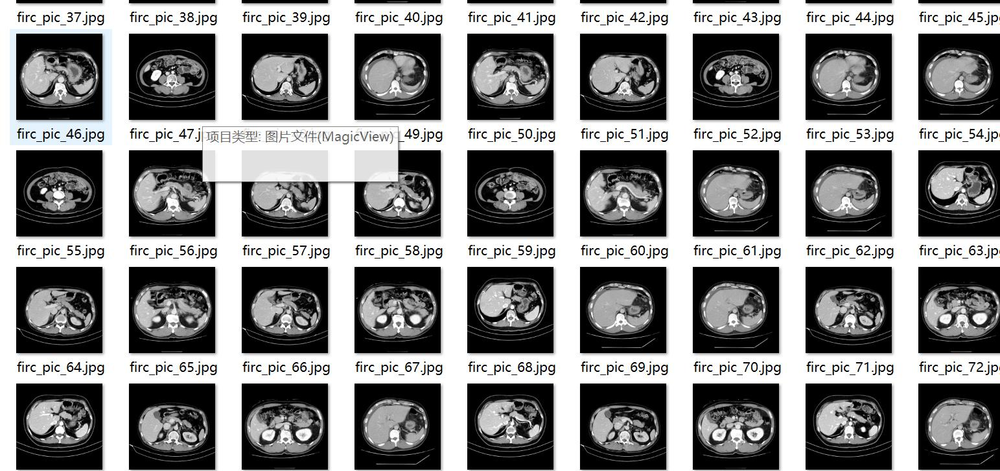
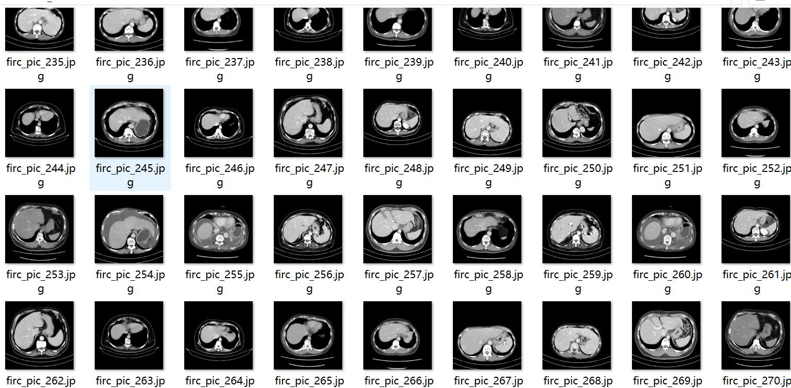
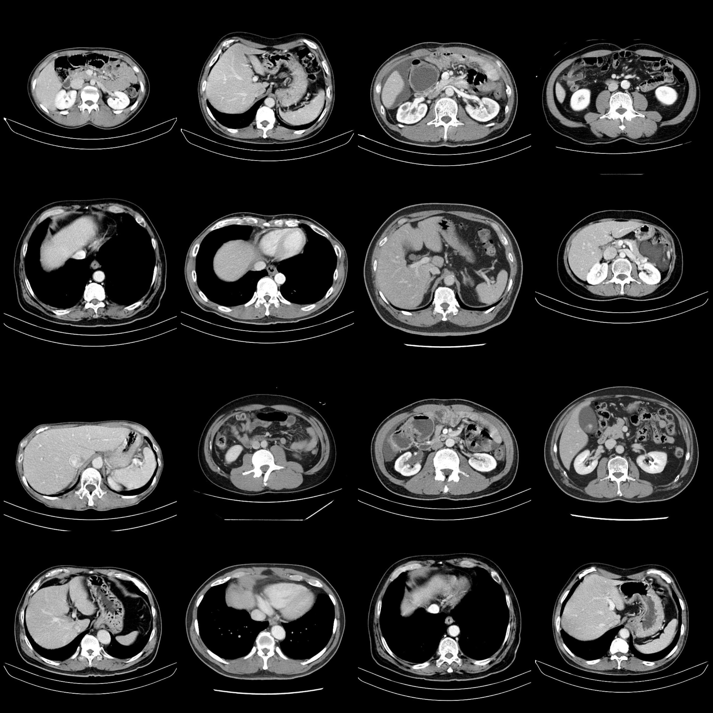
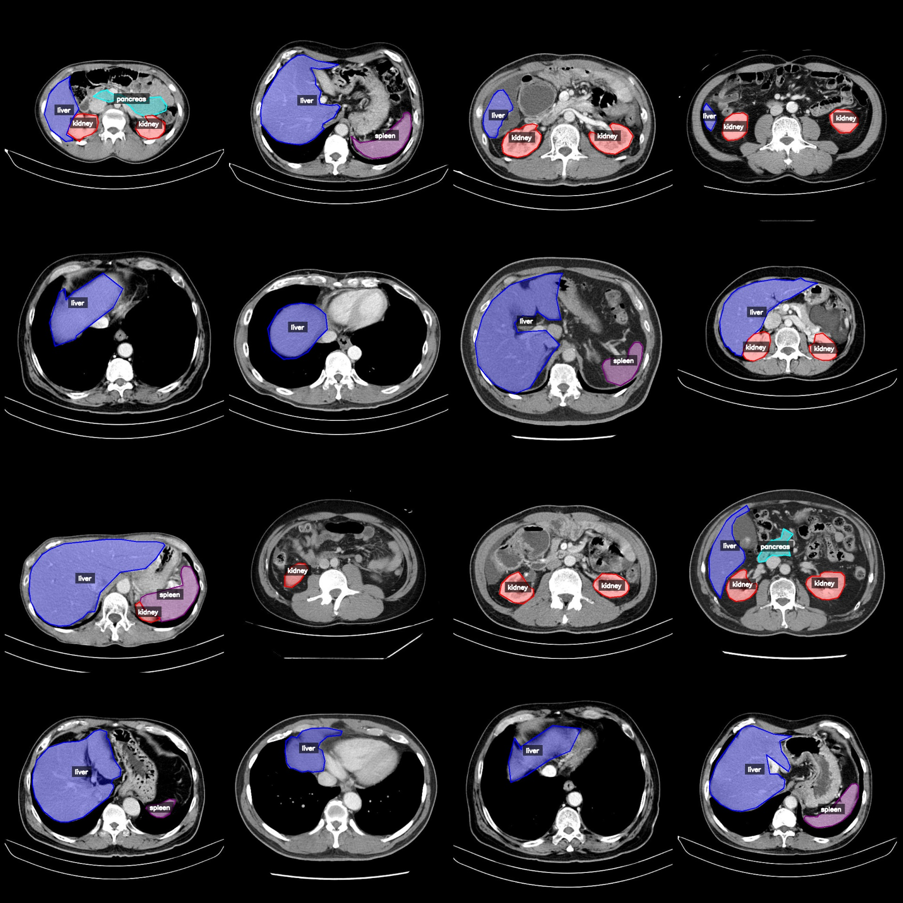
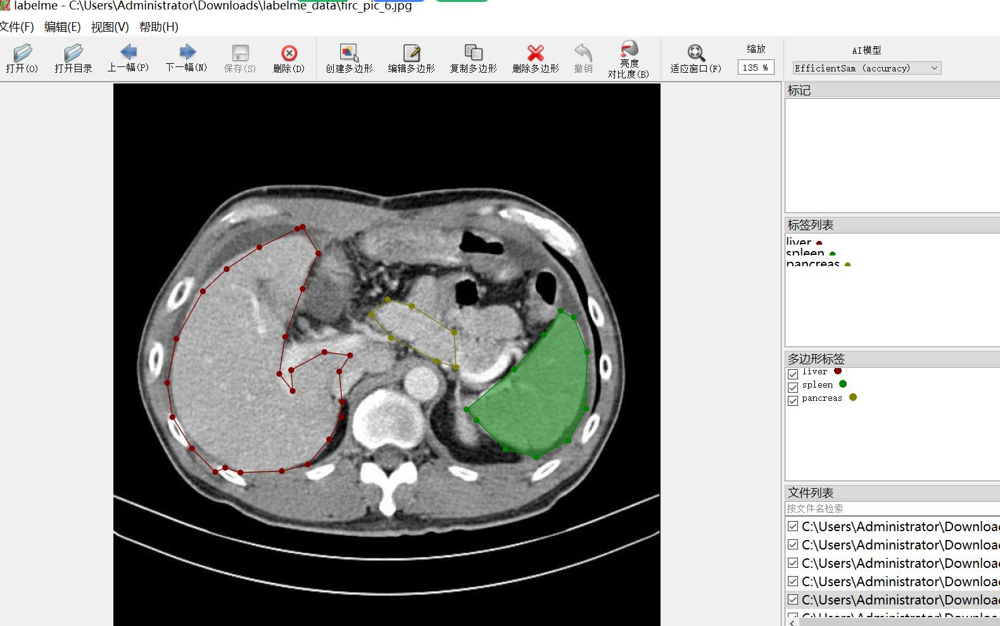

# Smart Health Pelvic CT Organ Identification and Segmentation Dataset (LabelMe format, 1030 images in total, 4 categories)

Dataset format: LabelMe format (excluding mask files, only including jpg images and corresponding json files)
Number of images (number of jpg files): 1030
Number of annotations (json file count): 1030
Number of annotation categories: 4
Annotation category names: ["kidney", "liver", "pancreas", "spleen"]
Each category annotation box count:
- Kidney (kidney) count = 1129
- Liver (liver) count = 923
- Pancreas (pancreas) count = 162
- Spleen (spleen) count = 421
Total number of boxes: 2635

Used labeling tool: labelme=5.5.0
Image resolution: 640x640
Annotation rules: Polygon is drawn around the category
Important notes: The dataset can be opened and edited with labelme, but the json dataset needs to be converted into either mask or Yolo format for instance segmentation or semantic segmentation.
Special declaration: This dataset does not guarantee any accuracy in the models trained or weights files.
Image preview:
Annotation examples:
Original images (select 16 images randomly):
Annotation drawing results:
LabelMe editing image example:

## Images

Here is a pay link on Stripe ( https://buy.stripe.com/3cs8yP7sY87d0vu9AB ). Please contact me lonlonago@foxmail.com after funding $89, and I will send you a complete data files , thank you!

